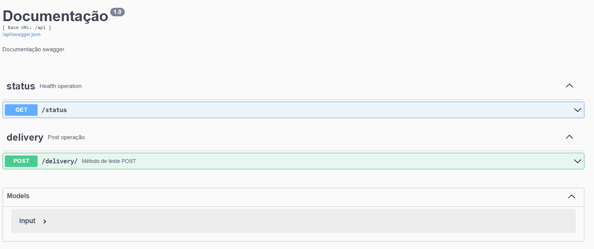

# Ateliware - Amazonia

chalange description:

```
Géfersom Bejos, CEO of the large Brazilian e-commerce
company amazônia, hired ateliware to develop a new system
responsible for calculating the fastest delivery route for his
new drone system.
Once the starting point, the object collection point, and the
delivery point are defined, his drones should, in the shortest
time possible, reach their destination.
Amazon is already a technology company, so it will be
providing a service by which it is possible to find out the time
needed to move between segments.

The challenge is based on building, within 1 week, a modern
web application, in any development technology
(Python/Django, express.js + React, PHP/Laravel, anything!)
that allows the user to inform the drone's origin position, the
object pickup position and the delivery destination.
All these positions should be informed as if they were
coordinates of a chessboard by letters on the horizontal axis
(A to H) and numbers on the vertical axis (1 to 8)

Once these 3 data are entered, the application must access
an API that, through a JSON, will inform the time required to
move between all the immediate vertical and horizontal
coordinates, for example from A1 to A2 and B1, or from C3 to
C4, B3, C2 and D3.

After hitting the API, and given the coordinates entered, the
application should calculate and inform on the screen the
fastest path to pick up the package and deliver it to the
destination, as well as the time elapsed by this path.
The movements between the coordinates of the trajectory will
only occur vertically (x-axis, of numbers) or horizontally
(y-axis, of letters).
The screen should also list the last 10 trips previously
calculated by the application.
The assessment object of delivery needs to be a public
repository on GitHub with the code, and a link for cloud
remote access to the working application.
The better practices applied on building this system, the
higher it will be rated. The next page lists the most important
points that will be evaluated in the challenge.
```

## build and run

```
docker-compose up
```
After run the compose comand, will be able to use the API, the documentation will be available at `localhost:5000/doc`


## Test

```
python3 -m venv venv
source venv/bin/activate
pip install -r requirements.txt
pytest
```

## Description

To handler the problem it was used a basic dijkstra method to calculate the minimum value to delivery, usining 2 times, first to calculate to get on checkpoint and later to go to the finish.
```
.
├── ...
├── amazon
│   ├── __init__.py
│   ├── __main__.py
│   └── api
│       ├── __init__.py
|       ├── app.py
|       ├── config.py
|       ├── settings.py
|       └── project
|           └── __init__.py
|           ├── restx.py
|           ├── api
|           |    ├── __init__.py
|           |    ├── amazon.py
|           |    └── health.py
|           ├── bo
|           |    ├── __init__.py
|           |    └── delivery.py
|           ├── constants
|           |    ├── __init__.py
|           |    ├── CodeHttp.py
|           |    └── Message.py
|           ├── exception
|           |    ├── __init__.py
|           |    ├── DataAcquisitionError.py
|           |    ├── DivisionError.py
|           |    ├── ExceptionError.py
|           |    └── NotTreatmentError.py
|           └── utils
|                ├── __init__.py
|                ├── doc_swagger.py
|                ├── logger.py
|                ├── response.py
|                ├── table.py
|                └── utils.py
└── ...
```

## License
For open source projects, say how it is licensed.

